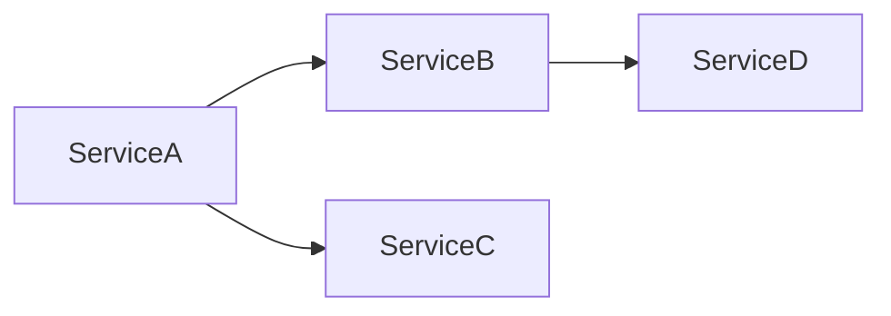

# Service Catalog

## Overview

This document provides a comprehensive catalog of all microservices in the **{{project_name}}** system, including ownership, communication patterns, and health monitoring.

## Service Inventory

| Service Name | Owner | Port | Repository | Status |
|-------------|-------|------|------------|--------|
| | | | | |

> Add each microservice as a row. Status values: `active`, `deprecated`, `planned`.

## Service Dependencies

> Maintain this diagram to reflect the current dependency graph between services. Identify any circular dependencies and resolve them.

## Communication Patterns

### Synchronous Communication

Services that communicate via direct request/response (REST, gRPC):

| Source Service | Target Service | Protocol | Endpoint | Purpose |
|---------------|---------------|----------|----------|---------|
| | | | | |

### Asynchronous Communication

Services that communicate via message brokers or event streams:

| Source Service | Target Service | Broker/Topic | Event Type | Purpose |
|---------------|---------------|-------------|------------|---------|
| | | | | |

> Prefer asynchronous communication for operations that do not require an immediate response. Use synchronous communication only when the caller needs the result to proceed.

## Health Check Endpoints

| Service Name | Health Endpoint | Expected Response | Check Interval | Timeout |
|-------------|----------------|-------------------|----------------|---------|
| | | | | |

> Every service must expose a health check endpoint. Use `/health` or `/healthz` as the convention. Health checks should verify downstream dependencies where applicable.
