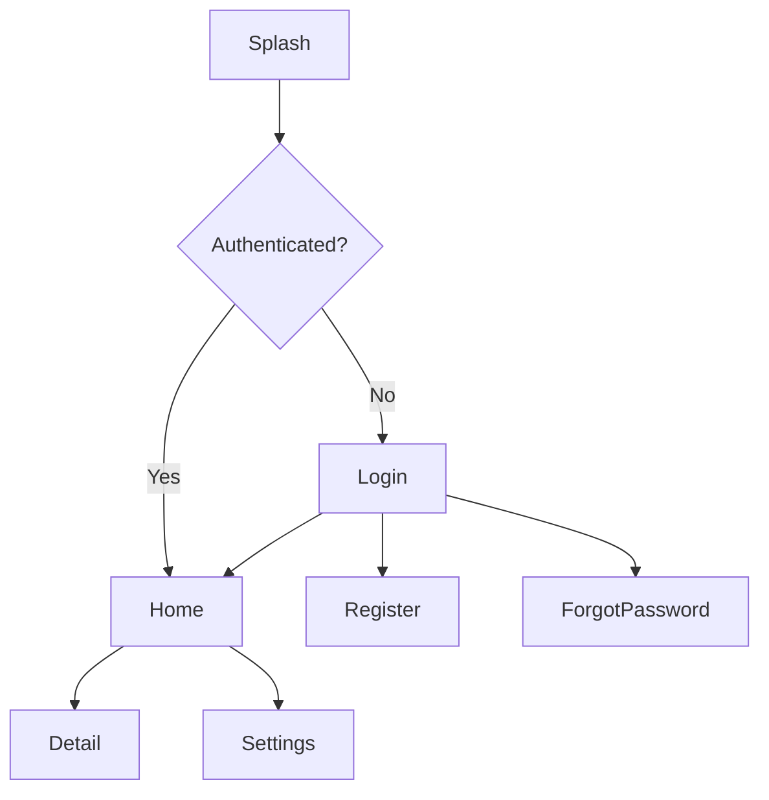

# Screen Inventory

## Overview

This document catalogs all screens in the **{{project_name}}** mobile application, including navigation flows, screen states, and deep linking configuration.

## Screen List

| Screen | Route | Auth Required | Platform | Description |
|--------|-------|---------------|----------|-------------|
| | | | | |

> Platform values: `both`, `ios`, `android`. Mark auth-required screens to enforce navigation guards.

## Navigation Flow



### Navigation Stack Structure

```
Root Navigator
  |-- Auth Stack
  |   |-- Login
  |   |-- Register
  |   |-- Forgot Password
  |-- Main Tab Navigator
  |   |-- Home Stack
  |   |   |-- Home
  |   |   |-- Detail
  |   |-- Settings Stack
  |       |-- Settings
  |       |-- Profile
  |-- Modal Stack
      |-- <!-- modal screens -->
```

## Screen States

Every screen must handle the following states:

### Loading State

- Display a skeleton loader or activity indicator
- Avoid blocking the entire screen when only a section is loading
- Show loading state within 100ms of initiating a request

### Error State

- Display a user-friendly error message
- Provide a retry action where applicable
- Log the error for diagnostics
- Differentiate between network errors and application errors

### Empty State

- Display an informative message explaining why there is no data
- Provide a call-to-action where appropriate (e.g., "Create your first item")
- Use illustrations or icons to make the empty state visually clear

### Data State

- Render the primary content
- Support pull-to-refresh where applicable
- Implement pagination or infinite scroll for lists

### State Matrix

| Screen | Loading | Error | Empty | Data | Offline |
|--------|---------|-------|-------|------|---------|
| | | | | | |

> Mark each state with `yes` if implemented, `n/a` if not applicable, or `todo` if pending.

## Deep Linking

### URL Scheme

- **Custom Scheme**: `{{project_name}}://`
- **Universal Links (iOS)**: `https://app.example.com/`
- **App Links (Android)**: `https://app.example.com/`

### Route Mapping

| Deep Link Path | Screen | Parameters | Auth Required |
|---------------|--------|------------|---------------|
| `/home` | Home | | No |
| `/detail/:id` | Detail | `id` | Yes |
| | | | |

### Handling

- Parse deep link parameters and navigate to the correct screen
- Queue deep links received before authentication and replay after login
- Validate all parameters before navigation
