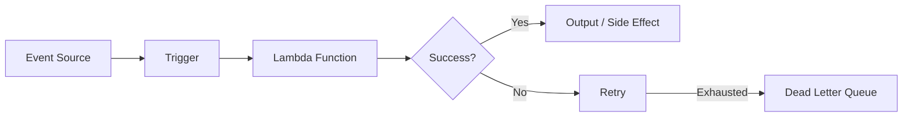
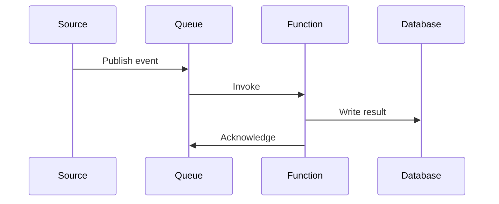

# Event Triggers

## Overview

This document describes the event-driven triggers that invoke serverless functions in **{{project_name}}**, including event flows, error handling, and monitoring strategies.

## Trigger Types

| Trigger | Source | Function | Schedule/Event | Batch Size | Description |
|---------|--------|----------|---------------|------------|-------------|
| | | | | | |

### HTTP Triggers (API Gateway)

| Method | Path | Function | Auth | Rate Limit | Description |
|--------|------|----------|------|------------|-------------|
| | | | | | |

### Schedule Triggers (Cron)

| Function | Schedule (cron) | Timezone | Description |
|----------|----------------|----------|-------------|
| | | | |

### Queue Triggers

| Queue | Function | Batch Size | Visibility Timeout | Description |
|-------|----------|------------|-------------------|-------------|
| | | | | |

### Storage Triggers

| Bucket/Container | Event Type | Prefix/Suffix Filter | Function | Description |
|-----------------|------------|---------------------|----------|-------------|
| | | | | |

### Database Triggers

| Table/Collection | Event Type | Function | Filter | Description |
|-----------------|------------|----------|--------|-------------|
| | | | | |

## Event Flow Diagrams

### Primary Event Flow

### Domain-Specific Flows

> Create a flow diagram for each major domain event chain.

## Error Handling

### Retry Configuration

| Trigger Type | Max Retries | Backoff | Retry Delay | Notes |
|-------------|-------------|---------|-------------|-------|
| API Gateway | 0 | N/A | N/A | Return error to caller |
| SQS | 3 | Linear | 30s | Message returns to queue |
| S3 | 2 | Exponential | N/A | Platform-managed |
| Schedule | 0 | N/A | N/A | Runs on next schedule |
| DynamoDB Stream | 3 | Exponential | N/A | Per-shard retry |

### Dead Letter Queues

| Source | DLQ Name | Max Receive Count | Alert Threshold | Retention |
|--------|----------|-------------------|----------------|-----------|
| | | | | |

### Error Categories

| Category | Action | Example |
|----------|--------|---------|
| Transient | Retry | Network timeout, throttle |
| Permanent | Send to DLQ | Validation error, missing resource |
| Poison Message | Send to DLQ + alert | Malformed payload causing crash |

> Distinguish between retryable and non-retryable errors in function code. Do not retry permanent failures.

## Monitoring & Alerting

### Key Metrics

| Metric | Function/Trigger | Threshold | Alert Severity | Action |
|--------|-----------------|-----------|---------------|--------|
| Error Rate | All | > 5% | Critical | Investigate immediately |
| Duration | All | > 80% of timeout | Warning | Optimize or increase timeout |
| Throttles | All | > 0 | Warning | Increase concurrency limit |
| DLQ Depth | All queues | > 0 | Warning | Investigate failed messages |
| Iterator Age | Stream triggers | > 60s | Warning | Consumer is falling behind |

### Dashboards

- **Overview Dashboard**: <!-- Link to dashboard showing all functions -->
- **Error Dashboard**: <!-- Link to error tracking dashboard -->
- **Cost Dashboard**: <!-- Link to cost monitoring -->

### Alerting Channels

| Severity | Channel | Response Time |
|----------|---------|--------------|
| Critical | <!-- e.g., PagerDuty, phone --> | < 15 minutes |
| Warning | <!-- e.g., Slack, email --> | < 1 hour |
| Info | <!-- e.g., Slack --> | Next business day |
